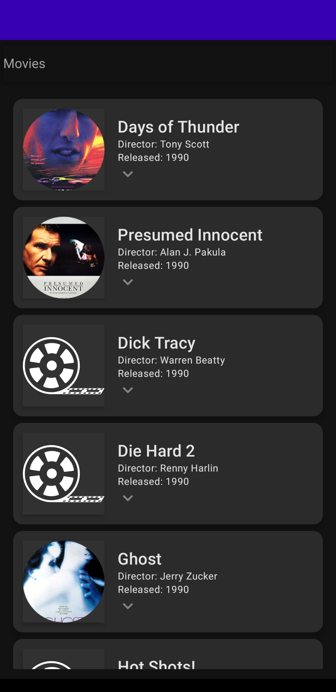
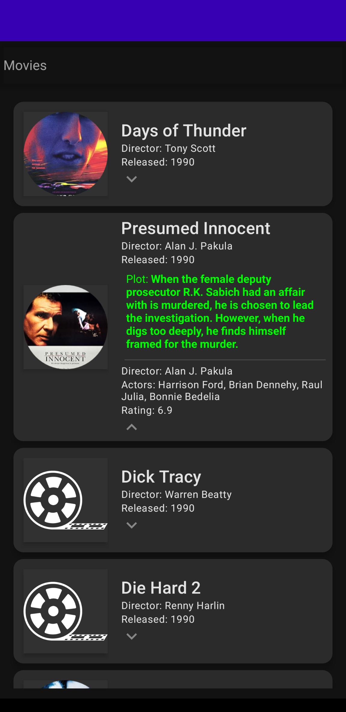
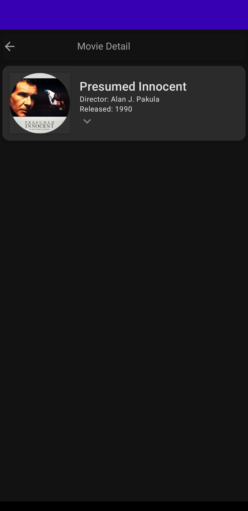
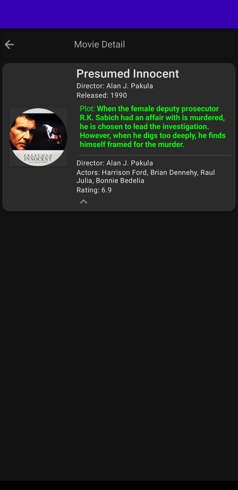

This is a compose application from Udemy course - Android Jetpack Compose: The Comprehensive Bootcamp \[2022]

The Movie Application

It contains:

- Lazy Column
- LocalContext 
- Coil to load images from url
- Expandable view with Animated Visibility
- Annotated string
- Loads movie from json asset
- Contains navigation to compose using Navigation Component
- Contains the passing of arguments in navigation
- Shows List and detail of movies

    

     
    
     

 